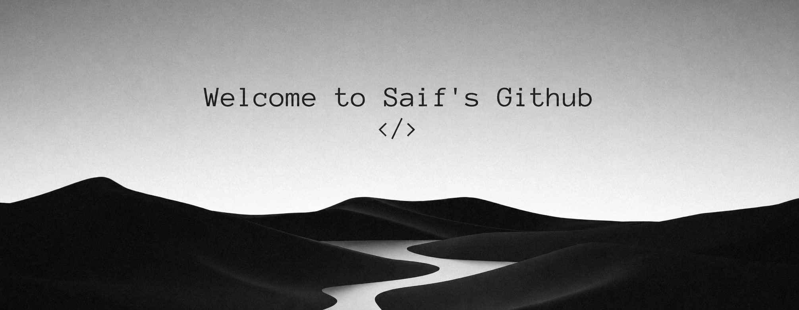

  

&nbsp;

## *About me*

Hello there! **I'm Saif Ur Rahman**, a final-year B.Tech CSM student specializing in **AI/ML and Cybersecurity** at AAR Mahaveer Engineering College (JNTUH), Hyderabad. I enjoy building real-world systems — from multi-agent AI pipelines to security tooling and full-stack SaaS products.

&nbsp;

🎓 &nbsp; ***B.Tech CSM (AI/ML + Cybersecurity) — JNTUH, Graduating 2027***  
🔐 &nbsp; ***Building: VitalSense AI — Real-time Sepsis Prediction System***  
🏆 &nbsp; ***Top 12 & 2nd in EdTech — CodeQuestOS × GradeSkills (900+ applicants)***  
🤖 &nbsp; ***Built multi-agent AI systems, SOC automation tools & SaaS products***  
🌍 &nbsp; ***Target: Masters at MBZUAI / Khalifa University, Dubai***  

&nbsp;

## *Technologies*

&nbsp;

## *Statistics*

&nbsp;

&nbsp;

  

